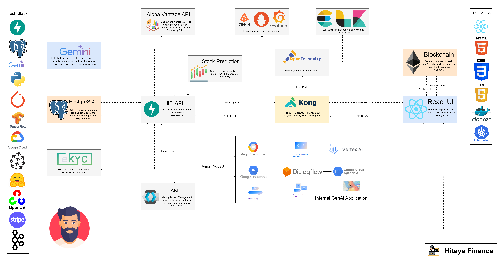
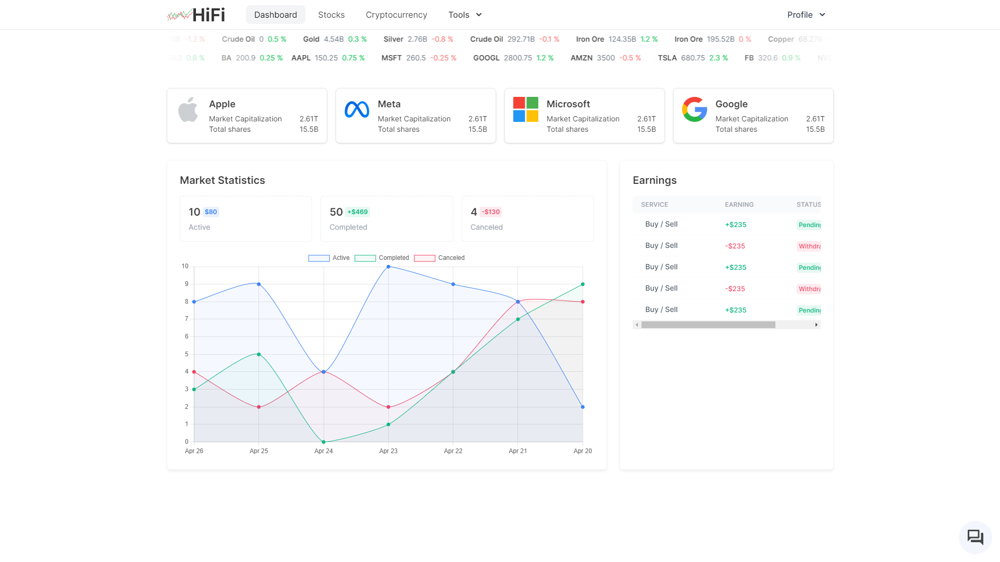

<h1 align="center">HiFi (Hitaya Finance)</h1>

### PROBLEM STATEMENT

In the current market, there aren't many applications that can explain the concept of Compound Interest to an average middle-class person, who has started to earn a bit of money, for most first-time earners, the stock market sounds like an alien concept, our application tries to make Investing easy, proving the user with detailed knowledge of Markets and stocks to invest, the Power of Compound Interest with the help of LLM, and our custom RAG Models that are being used in our Chatbots.

<strong>HiFi</strong> is a financial application that helps make investing easier for first-time users. 

<strong> 1. Providing stock analytics data, news feeds, and event information. </strong>

Gather stock fundamental details like about the company, <strong>quarter results, profit and loss, balance sheets cash flow  ratios, shareholding patterns, news</strong> about the company, and events. <strong>Using GenAI LLMs to make informed decisions.  Peer-to-peer stock comparison</strong> related to the same category.

<strong> 2. Generating buy-sell decisions based on Market sentiments.</strong>

<strong>Identify risk management based on input</strong>, leveraging <strong>LLMs</strong> understand the current situation and predict the future price of the stock and show whether <strong>user should  buy, hold, or sell the stock from user portfolio to minimize the risk</strong>.

<strong> 3. Blockchain-enabled security for premium customers.</strong>

Users can opt for premium plans to secure their data by using <strong>blockchain technology under the hood to make it decentralized and safeguard their information</strong>.

# Features 

- Provide stock analytics data, news feeds, and event information.
- <strong>Generating buy-sell decisions</strong> based on Market sentiments.
- <strong>Generating buy-sell signals</strong> for intraday trades, and equity investments.
- <strong>LLMs to minimize risk and maximize profit</strong>.
- <strong>Kill switch option</strong> for intraday & F&O.
- Portfolio Dashboard.
- Option to <strong>automate trade</strong> from the wallet.
- Connect with a broker.

# Advance Features

- Users can opt for premium plans to secure their data by using <strong> blockchain technology under the hood to make it decentralized and safeguard their information. </strong>
- LLMs are used for personalized recommendations, portfolio management, and risk management using RAG models.
- Enabling follow trading for users who want to make trading data public that others can utilize to <strong>create/replicate trading strategies.</strong>

## Multi-Agent Collaboration for Financial Analysis 

Multi-agent collaboration in financial analysis is like assembling a team of financial detectives, each with their own specialized skills, working together to crack the case. These agents—powered by large language models (LLMs)—combine forces to tackle complex financial problems. Picture it as a high-stakes brainstorming session where everyone brings their A-game.


<strong>The AgentUniverse Framework:</strong>
- It’s like the backstage crew ensuring that our financial agents hit all the right notes.
- What It Does: AgentUniverse provides a flexible and extensible platform for building individual agents. These agents can be LLM-based, meaning they leverage the power of language models (think GPT-4 or its future cousins).
- Collaboration Mode Components: Here’s where the magic happens. AgentUniverse features a set of multi-agent collaboration mode components. Imagine these as different choreography styles for our financial dancers. Each component specializes in solving specific types of problems.
- <strong>PEER Mode Component:</strong> This one’s like a synchronized routine. Agents take on different roles—Plan, Execute, Express, and Review. They break down complex problems, execute steps in sequence, and iteratively improve based on feedback. Think of it as a financial interpretive dance.
- <strong>DOE Mode Component:</strong> Data-fining, Opinion-inject, and Express—these agents form a trio. They tackle data-intensive tasks, maintain computational precision, and incorporate expert opinions. It’s like a financial jazz ensemble.

<strong>In Summary:</strong>
Multi-agent collaboration for financial analysis is like a symphony where LLM-powered agents harmonize, riff off each other, and create beautiful financial melodies. 🎶📊

So, whether you’re decoding market signals, predicting trends, or optimizing portfolios, remember: Behind the scenes, our financial agents are waltzing, cha-cha-ing, and occasionally doing the moonwalk—all for better insights! 🌟🤖

<p align="center">
  
</p> 

## 1. Project Architecture

<p align="center">
  
</p> 


## 2. Getting Started With The Fast API Application

```sh
$ git clone https://github.com/IntelegixLabs/HiFi.git
$ cd HiFi
$ pip install -r requirements.txt
$ python main.py
```

Swagger UI `http://localhost:5000/docs`

Run `uvicorn main:app --reload`


#### Listen to Stripe events

<span>Use Stripe CLI to simulate Stripe events in your local environment or <a href="https://stripe.com/docs/webhooks" target="__blank" rel="noopener noreferrer">learn more about Webhooks</a>.</span>

1. <span><a href="https://stripe.com/docs/stripe-cli" target="__blank" rel="noopener noreferrer">Download the CLI</a> and log in with your Stripe account</span>

```commandline
stripe login
```

2. Forward events to your webhook

```commandline
stripe listen --forward-to localhost:5000/payments/stripe/webhook
```

3. Trigger events with the CLI

```commandline
stripe trigger payment_intent.succeeded

stripe trigger subscription_schedule.canceled

stripe trigger invoice.upcoming

stripe trigger charge.captured

stripe trigger invoice.payment_succeeded
```

## 3. Running the Test Cases

```sh
$ cd HiFi
$ pytest --disable-warnings  
```

## 4. Run this project with docker locally

```sh
$ cd HiFi
$ docker system prune 
$ docker-compose -f docker-compose.yml up -d --build
```


## 5. Getting Started With UI Application

```sh
$ git clone https://github.com/IntelegixLabs/HiFi_UI.git
$ cd HiFi_UI
$ npm i
```


## 6. Project Requirements

<h4>Languages</h4>
<ul>
  <li>KeyCloak 24.0.0</li>
  <li>Python 3.12.1</li>
</ul>

## 7. Google GenAI Tools Used

<strong>1. MakerSuite</strong>

MakerSuite is a fast, easy way to start building generative AI apps. It provides an efficient UI for prompting some of Google’s latest models and easily translates prompts into production-ready code you can integrate into applications. 

Interacting with LLMs is as straightforward as crafting a plain language prompt, making it accessible to everyone. Prompts can be as simple as a single input, but you have the flexibility to provide additional context or examples, effectively guiding the model to produce the most optimal response. 

<strong>2. VertexAI</strong>

Generative AI on Vertex AI (also known as genAI or gen AI) gives access to many large generative AI models to evaluate, tune, and deploy them for use in  AI-powered applications.  

<strong>3. Model Garden </strong>

Google's opinionated take on the world's best models across first-party, third-party, and open-source models. Our curated set of 130+ available models is best in class for their category, helping customers access the performing foundation models that are best suited for their business needs.

Easily customize these models with your own data, deploy to applications with just one click, and scale with end-to-end ML Ops built-in.

<strong>4. Gemini-pro </strong>

Designed to handle natural language tasks, multi-turn text and code chat, and code generation. Gemini 1.0 Pro for prompts that only contain text.

<strong>5. Gemini-pro-vision </strong>

Multimodal model that supports adding image, PDF, and video in text prompts for a text or code response. Gemini 1.0 Pro Vision multimodal prompts.

<strong>6. Dialogflow </strong>

Building Agents with low-code no-low tools using Vertex AI Agent Builder and Dialogflow. We can connect our documents to the Dialogflow CX agent and leverage foundation models for generating responses from the content, out of the box. 

Also call a foundation model to perform specific tasks during a virtual agent conversation or respond to a query contextually, significantly reducing development effort and making virtual agents more conversational.

<strong>7. Chirp </strong>

Chirp is the next generation of Google's speech-to-text models. Representing the culmination of years of research, the first version of Chirp is now available for Speech-to-Text. Intended to improve and expand Chirp to more languages and domains. Chirp models are trained with a different architecture than our current speech models. 

<strong>8. GCS buckets </strong>

Cloud Storage is a managed service for storing unstructured data. Store any amount of data and retrieve it as often as you like.


## 8. Application Screenshots / <a href="">Demo.</a>

<p align="center">
  
  
  
  
  
  
  
  
  
  
  
  
</p>

## 9. Real-time  API monitoring </h3>

- Kong API Gateway
- Zipkin 
- Prometheus
- Grafana
- Logstash
- Elasticsearch
- Kibana

<p align="center">
  
  
  
  
  
  
</p> 


## 9. Components to be built (Work In Progress)

* [x] API Enhancement.

